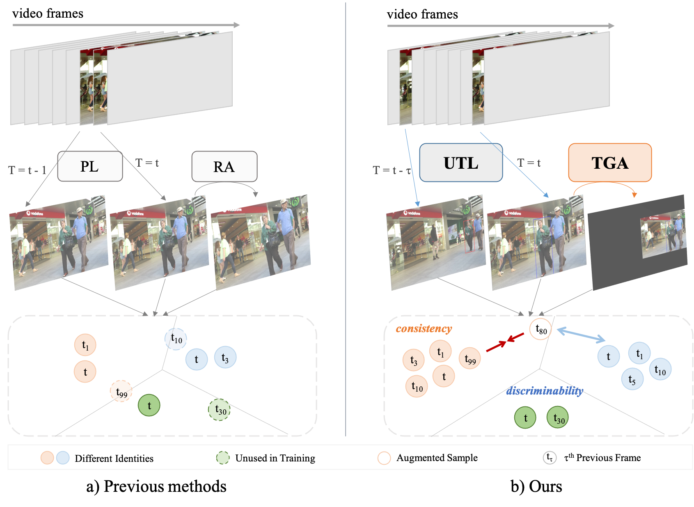

# u2mot

This repo is the official implementation of [Uncertainty-aware Unsupervised Multi-Object Tracking](https://arxiv.org/abs/2307.15409)

## Abstract

Without manually annotated identities, unsupervised multi-object trackers are inferior to learning reliable feature embeddings. It causes the similarity-based inter-frame association stage also be error-prone, where an uncertainty problem arises. The frame-by-frame accumulated uncertainty prevents trackers from learning the consistent feature embedding against time variation. To avoid this uncertainty problem, recent self-supervised techniques are adopted, whereas they failed to capture temporal relations. The inter-frame uncertainty still exists. In fact, this paper argues that though the uncertainty problem is inevitable, it is possible to leverage the uncertainty itself to improve the learned consistency in turn. Specifically, an uncertainty-based metric is developed to verify and rectify the risky associations. The resulting accurate pseudo-tracklets boost learning the feature consistency. And accurate tracklets can incorporate temporal information into spatial transformation. This paper proposes a tracklet-guided augmentation strategy to simulate the tracklet’s motion, which adopts a hierarchical uncertainty-based sampling mechanism for hard sample mining. The ultimate unsupervised MOT framework, namely U2MOT, is proven effective on MOT-Challenges and VisDrone-MOT benchmark. U2MOT achieves a SOTA performance among the published supervised and unsupervised trackers.

<p align="center"></p>


## Installation
Step1. Install u2mot (verified with PyTorch=1.8.1).
```shell
git clone https://github.com/alibaba/u2mot.git
cd u2mot
python -m pip install -r requirements.txt
python setup.py develop
```

Step2. Install [pycocotools](https://github.com/cocodataset/cocoapi).

```shell
python -m pip install cython
python -m pip install 'git+https://github.com/cocodataset/cocoapi.git#subdirectory=PythonAPI'
```

Step3. Others
```shell
python -m pip install cython_bbox
```


## Data preparation


Download [MOT17](https://motchallenge.net/), [MOT20](https://motchallenge.net/), [CrowdHuman](https://www.crowdhuman.org/), [Cityperson](https://github.com/Zhongdao/Towards-Realtime-MOT/blob/master/DATASET_ZOO.md), [ETHZ](https://github.com/Zhongdao/Towards-Realtime-MOT/blob/master/DATASET_ZOO.md), [VisDrone-MOT](https://github.com/VisDrone/VisDrone-Dataset), [BDD100K-MOT](https://bdd-data.berkeley.edu/)(optional)and put them under <u2mot_HOME>/datasets in the following structure:
```
datasets
   |——————MOT17/images
   |        └——————train
   |        └——————test
   └——————MOT20/images
   |        └——————train
   |        └——————test
   └——————CrowdHuman
   |         └——————images
   |         └——————annotation_train.odgt
   |         └——————annotation_val.odgt
   └——————Cityscapes
   |        └——————images
   |        └——————labels_with_ids
   └——————ETHZ
   |        └——————eth01
   |        └——————...
   |        └——————eth07
   └——————VisDrone-MOT
   |        └——————VisDrone2019-MOT-train
   |        └——————VisDrone2019-MOT-val
   |        └——————VisDrone2019-MOT-test-dev
   └——————BDD100K-MOT (optional)
            └——————images
            └——————labels

```

Then, you need to turn the datasets to COCO format, and the results will be saved in `datasets/<dataset>/annotations`:

```shell
python tools/data/convert_mot17_to_coco.py
python tools/data/convert_mot20_to_coco.py
python tools/data/convert_crowdhuman_to_coco.py
python tools/data/convert_cityperson_to_coco.py
python tools/data/convert_ethz_to_coco.py
python tools/data/convert_visdrone_to_coco.py
python tools/data/convert_bdd100k_to_coco.py
```


Before mixing different datasets, you need to follow the operations in `tools/data/mix_data_xxx.py` to create data folders and soft-links.
Finally, you can mix the training data for MOT-Challenge benckmarks (no extra training data is needed for VisDrone-MOT and BDD100K-MOT benchmark):

```shell
python tools/data/mix_data_test_mot17.py
python tools/data/mix_data_test_mot20.py
```


## Model zoo

The pre-trained weights are provided blow:

| Benchmark | Split |  Weights | HOTA | MOTA | IDF1 |  IDs  |
|:---------:|:-----:|:--------:|:----:|:----:|:----:|:-----:|
|   MOT17   |  test | [link]() | 64.5 | 80.9 | 78.8 |  1590 |
|   MOT20   |  test | [link]() | 62.7 | 76.7 | 76.5 |  1552 |
|  VisDrone |  test | [link]() |   -  | 55.9 | 70.0 |  1282 |
|  BDD100K  |  val  | [link]() | 58.7 | 62.9 | 68.9 | 16191 |
|  BDD100K  |  test | [link]() | 58.3 | 63.0 | 69.2 | 29985 |

Since we adopt several tracking tricks from [BoT-SORT](https://github.com/NirAharon/BoT-SORT), some of the results are slightly different from the performance reported in the paper.

For higher results, you may carefully tune the tracking parameters of each sequence, including detection score threshold, matching threshold, etc.

## Training

The COCO pretrained YOLOX model can be downloaded from their [model zoo](https://github.com/Megvii-BaseDetection/YOLOX/tree/0.1.0). After downloading the pretrained models, you can put them under `<u2mot_HOME>/pretrained`.

* **Train ablation model (MOT17 half train)**

```shell
python tools/train.py -f exps/example/u2mot/yolox_x_ablation_u2mot17.py -d 2 -b 12 --fp16 -o -c pretrained/yolox_x.pth.tar
```

* **Train MOT17 test model (MOT17 train, CrowdHuman, Cityperson and ETHZ)**

```shell
python tools/train.py -f exps/example/u2mot/yolox_x_mix_u2mot17.py -d 2 -b 12 --fp16 -o -c pretrained/yolox_x.pth.tar
```


For MOT20, VisDrone-MOT, and BDD100K-MOT, you need to clip the bounding boxes inside the image.
Specifically, set `_clip=True` for `yolox/data/data_augment.py:line177`, `yolox/data/datasets/mosaicdetection.py:line86/358`, and `yolox/utils/boxes.py:line149`.

* **Train MOT20 test model (MOT20 train, CrowdHuman)**

```shell
python tools/train.py -f exps/example/u2mot/yolox_x_mix_u2mot20.py -d 2 -b 12 --fp16 -o -c pretrained/yolox_x.pth.tar
```

* **Train VisDrone-MOT test model**

```shell
python tools/train.py -f exps/example/u2mot/yolox_x_u2mot_visdrone.py -d 2 -b 12 --fp16 -o -c pretrained/yolox_x.pth.tar
```

* **Train BDD100K-MOT test model**

```shell
python tools/train.py -f exps/example/u2mot/yolox_x_u2mot_bdd100k.py -d 2 -b 12 --fp16 -o -c pretrained/yolox_x.pth.tar
```

* **Train with frozen detector**

To alleviate the optimization problem on detection head and reid head, you can train the detector (following [ByteTrack](https://github.com/ifzhang/ByteTrack)) first, and then train the reid head only:

```shell
python tools/train.py -f exps/example/u2mot/your_exp_file.py -d 2 -b 12 --fp16 -o -c pretrained/your_detector.pth.tar --freeze
```


* **Train on custom dataset**

First, you need to prepare your dataset in COCO format. You can refer to [MOT-to-COCO](tools/data/convert_mot17_to_coco.py) or [VisDrone-to-COCO](tools/data/convert_visdrone_to_coco.py). 
Second, you need to create a Exp file for your dataset. You can refer to the [MOT17](exps/example/u2mot/yolox_x_mix_u2mot17.py) training Exp file. Don't forget to modify `get_data_loader()` and `get_eval_loader()` in your Exp file. 
Third, modify the configuration at `img_path2seq()`, `check_period()`, and `get_frame_cnt()` functions to parse your image path and video info in `yolox/data/datasets/mot.py`.
Finally, you can train u2mot on your dataset by running:

```shell
python tools/train.py -f exps/example/u2mot/your_exp_file.py -d 2 -b 12 --fp16 -o -c pretrained/yolox_x.pth.tar
```


## Tracking

* **Evaluation on MOT17 half val**

Performance on MOT17 half val is evaluated with the official [TrackEval](https://github.com/JonathonLuiten/TrackEval) (the configured code has been provided at `<u2mot_HOME>/TrackEval`).

First, run `u2mot` to get the tracking results, which will be saved in `pretrained/u2mot/track_results`:

```shell
python tools/track.py datasets/MOT17/images/train --benchmark MOT17-val -f exps/example/u2mot/yolox_x_ablation_u2mot17.py -c pretrained/u2mot/ablation.pth.tar --device 0 --fp16 --fuse
```

To leverage `UTL` in inference stage, just add the `--use-uncertainty` flag:

```shell
python tools/track.py datasets/MOT17/images/train --benchmark MOT17-val -f exps/example/u2mot/yolox_x_ablation_u2mot17.py -c pretrained/u2mot/ablation.pth.tar --device 0 --fp16 --fuse --use-uncertainty
```

Then, run `TrackEval` to evaluate the tracking performance:

```shell
cd ./TrackEval
python scripts/run_mot_challenge.py --BENCHMARK MOT17 --SPLIT_TO_EVAL train --TRACKERS_TO_EVAL ../../../../../YOLOX_outputs/yolox_x_ablation_u2mot17 --TRACKER_SUB_FOLDER track_res --OUTPUT_SUB_FOLDER track_eval --METRICS HOTA CLEAR Identity --USE_PARALLEL False --NUM_PARALLEL_CORES 1 --SEQMAP_FILE data/gt/mot_challenge/seqmaps/MOT17-train.txt --GT_LOC_FORMAT '{gt_folder}/{seq}/gt/gt.half_val.txt' --PRINT_CONFIG False --PRINT_ONLY_COMBINED True --DISPLAY_LESS_PROGRESS True
```

* **Test on MOT17**

Run `u2mot`, and the results will be saved in `YOLOX_outputs/yolox_x_mix_u2mot17/track_res`:

```shell
python tools/track.py datasets/MOT17/images/test --benchmark MOT17 -f exps/example/u2mot/yolox_x_mix_u2mot17.py -c pretrained/u2mot/mot17.pth.tar --device 0 --fp16 --fuse --cmc-method file --cmc-file-dir MOTChallenge
python tools/interpolation.py --txt_path YOLOX_outputs/yolox_x_mix_u2mot17/track_res --save_path YOLOX_outputs/yolox_x_mix_u2mot17/track_res_dti
```
Submit the txt files under `track_res_dti` to [MOTChallenge](https://motchallenge.net/) website for evaluation.

* **Test on MOT20**

We use the input size 1600 x 896 for MOT20-04, MOT20-07 and 1920 x 736 for MOT20-06, MOT20-08.

Run `u2mot`:

```shell
python tools/track.py datasets/MOT20/images/test --benchmark MOT20 -f exps/example/u2mot/yolox_x_mix_u2mot20.py -c pretrained/u2mot/mot20.pth.tar --device 0 --fp16 --fuse --cmc-method file --cmc-file-dir MOTChallenge
python tools/interpolation.py  --txt_path YOLOX_outputs/yolox_x_mix_u2mot20/track_res --save_path YOLOX_outputs/yolox_x_mix_u2mot20/track_res_dti
```

Submit the txt files under `track_res_dti` to [MOTChallenge](https://motchallenge.net/) website for evaluation.


* **Test on VisDrone-MOT**

We use the input size 1600 x 896 for VisDrone-MOT benchmark. Following [TrackFormer](https://github.com/timmeinhardt/trackformer) the performance is evaluated with the default [motmetrics](https://github.com/cheind/py-motmetrics).

Run `u2mot`, and the results will be saved at `YOLOX_outputs/yolox_x_u2mot_visdrone/track_res`:

```shell
python tools/track.py datasets/VisDrone-MOT/VisDrone2019-MOT-test-dev/sequences --benchmark VisDrone -f exps/example/u2mot/yolox_x_u2mot_visdrone.py -c pretrained/u2mot/visdrone.pth.tar --device 0 --fp16 --fuse --cmc-method file --cmc-file-dir VisDrone/test-dev
```

Evaluate the results:

```shell
python tools/utils/eval_visdrone.py
```

You will get the performance on MOTA, IDF1 and ID switch.

* **Test on BDD100K-MOT**

Run `u2mot`, and the results will be saved at `YOLOX_outputs/yolox_x_u2mot_bdd100k/track_res`:

```shell
python tools/track.py datasets/BDD100K-MOT/images/test --benchmark BDD100K -f exps/example/u2mot/yolox_x_u2mot_bdd100k.py -c pretrained/u2mot/bdd100k.pth.tar --device 0 --fp16 --fuse --cmc-method file --cmc-file-dir BDD100K/{split}
```

Then, convert the result files into `json` format, zip those json files, and submit to the official website [EvalAI](https://eval.ai/web/challenges/challenge-page/1836/submission) to get the traking performance:

```shell
python tools/utils/convert_bdd.py
cd YOLOX_outputs/yolox_x_u2mot_bdd100k
zip -r -q bdd100k_pred.zip ./track_res_json
```

**Be careful to evaluate on `val` and `test` splits *separately*.**


## Citation

```
@inproceedings{liu2023u2mot,
  title={Uncertainty-aware Unsupervised Multi-Object Tracking},
  author={Liu, Kai and Jin, Sheng and Fu, Zhihang and Chen, Ze and Jiang, Rongxin and Ye, Jieping},
  booktitle={International Journal of Computer Vision},
  year={2023}
}
```

## Acknowledgement

A large part of the code is borrowed from [YOLOX](https://github.com/Megvii-BaseDetection/YOLOX), [FairMOT](https://github.com/ifzhang/FairMOT), [ByteTrack](https://github.com/ifzhang/ByteTrack), [ByteTrack_ReID](https://github.com/HanGuangXin/ByteTrack_ReID), and [BoT-SORT](https://github.com/NirAharon/BoT-SORT). Many thanks for their wonderful works.